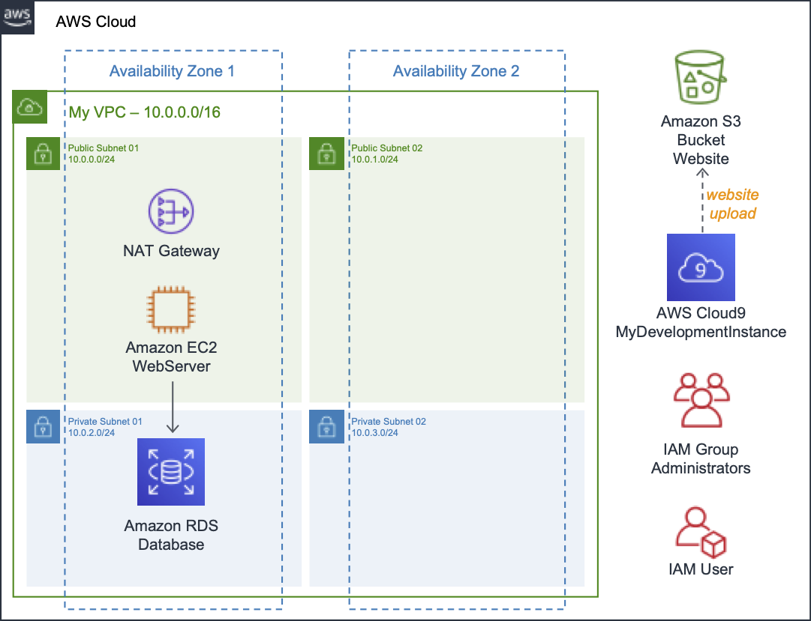
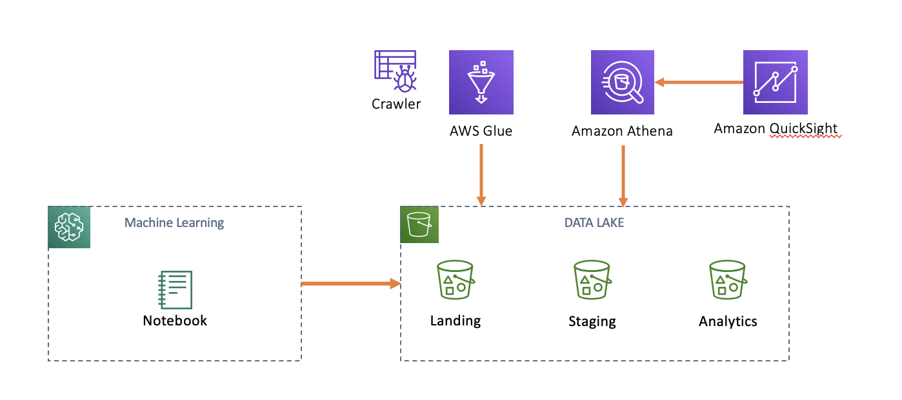

# NPO Workshops - Imersão de Conteúdos Práticos.

Repositório para agregar conteúdos em PT-BR para os clientes AWS do Setor Público.

# Worskshop sobre CORE Services AWS

Workshop desenvolvido para explorar os Serviços Principais da AWS.

Neste workshop, você hospedará um site estático e criará uma arquitetura de aplicativos de duas camadas, cobrindo os principais serviços e as práticas recomendadas para computação, rede, armazenamento e bancos de dados.

Veja o diagrama abaixo para uma descrição da arquitetura completa.

[Core Services - Parte 1 - Site estático com S3 e CloudFront](core/core-s3-cloudfront.MD).

[Core Services - Parte 2 - Arquitetura de 2 layers com EC2 e RDS](core/core-ec2-rds.MD).

# Workshop Analytics

O Workshop de Analytics irá demonstrar a criação de um Datalake na AWS passando pelos processos de extração, transformação e visualização com os principais serviços de Analytics da AWS.

Arquitetura do Workshop:

[Analytics - Parte 1 - S3, Glue, Athena e Quicksight](analytics/analytics.MD).

# Workshop Containers

TBD

# Workshop Serverless

TBD

## Conta da AWS necessária
Para concluir esses workshops, você precisará de uma conta ativa da AWS válida com permissões de administrador. 
Se estiver participando de um workshop guiado, irá utilizar plataforma: [Event Engine](https://dashboard.eventengine.run/login) para isto. O arquiteto que está ministrando o Workshop deve lhe passar algum HASH.
