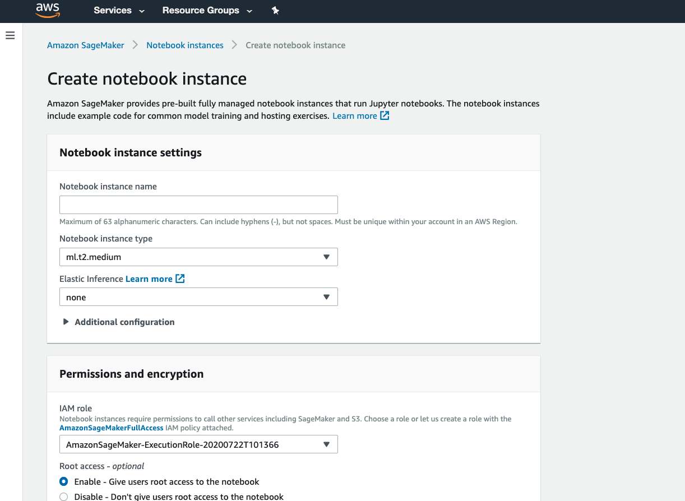
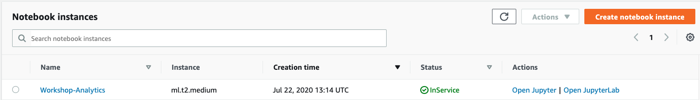
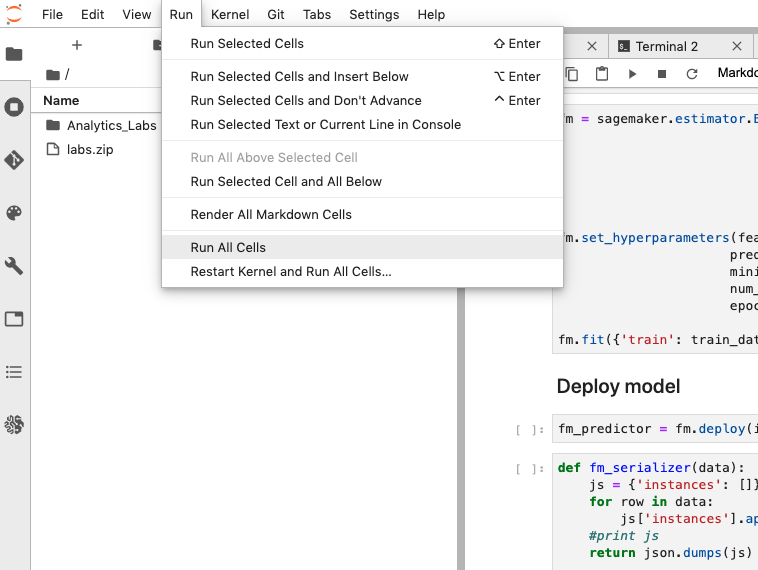
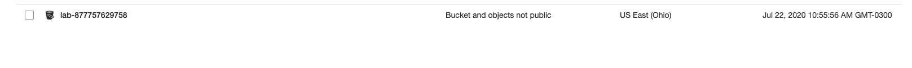
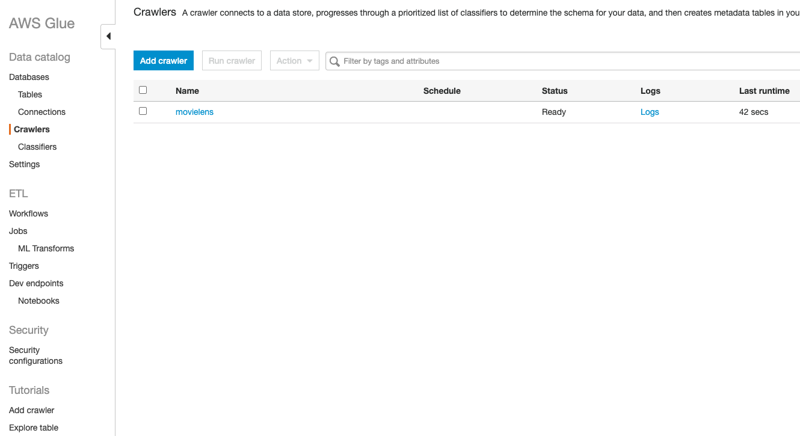

# Workshop Analytics

Este workshop tem como intuito utilizar alguns serviços do segmento de Big Data e Analytics da AWS.

Iremos construir a seguinte arquitetura utilizando os serviços AWS:

## Arquitetura


# Serviços

## Sagemaker Notebooks

O Sagemaker é o serviço de Machine Learning da AWS que fornece um pipeline inteiro de ferramentas para criar, treinar e implantar modelos de machine learning.

Neste workshop iremos utilizar o SageMaker para rodar Jupyter Notebooks e você pode saber mais sobre eles [AQUI](https://jupyter.org/).

Então vamos iniciar o processo de criação de uma instância de Sagemaker Notebooks.

- Primeiro, entre no serviço do SageMaker:


- Do lado esquerdo, clique em Notebook Instances:

- Agora, clique em Create notebook Instance:

- Na aba de Notebook Instance, o único valor a ser alterado é o Notebook Instance Name, que no caso utilizaremos Workshop-Analytics. Todos os outros valores pode deixar o default. Clique em Create notebook instance.



- Alguns minutos após a criação, o status será `InService`.  Clique em Open `JupyterLab`.



- Abra um terminal, clicando em: File > New > Terminal.

- Digite os seguintes comandos:

````
$ cd sample-notebooks
$ cd SageMaker/
$ git clone https://github.com/BRPSNPO/workshops.git
````

Automaticamente, na barra de arquivos ao lado irá aparecer os arquivos. 

- Entre na pasta workshops/analytics e dê 2 cliques no arquivo workshop-analytics.ipynb.

Vamos executar as células do noteboook clicando em:

Run > Run All Cells.



As células estão comentadas para melhor entendimento do que está sendo feito.


## S3

S3 é o serviço da AWS utilizado para criação de Datalakes. Isto porque ele substitui o magistral HDFS para armazenamento de grandes massas de dados em formato de objetos sem precisar de previa configuração de capacidade (de disco) e de capacidade de processamento (cpu/memória). Diferente de um storage convencional.

Neste workshop é importante aprendermos como abrir o serviço do S3 e entender um pouco o console e o método de armazenamento.

- Abra uma nova aba do console AWS e pesquise por S3.

O Bucket lab-* foi criado quando executamos todas as células do Notebook.



## Glue

O Glue é um serviço de (ETL) Extração, Transformação e carga da AWS, totalmente gerenciado que facilita a preparação e a carga de dados para análises pelos clientes.

Iremos criar um Database e um Crawler.

Database:
- Pesquise pelo serviço AWS Glue;
- Clique em Databases > ADD Database;
- Dê um nome para o database: movielens;
- Clique em Create.
- Você deve ver uma tela como a abaixo:


Crawler:
- Clique em Crawler > ADD Crawler;
- Dê um nome para o Crawler: movielens e clique NEXT;
- Deixe selecionado Data Stores e selecione NEXT;
- Clique na pastinha para selecionar o Bucket que criamos, e selecione a pasta: data > analytics;
- Clique em Next > No > Next > Create Crawler;
O crawler leverá alguns segundos para ser criado.

Quando o `status` mudar para Ready, selecione o Crawler e clique em `RUN Crawler`.




Retorne a aba de databases e clique em Tables.

Você verá as tabelas criadas de acordo com o arquivo que fizemos upload no S3 através do notebook.


## Athena

O Athena é um serviço que executa consultas em SQL em dados armazenados no S3. Totalmente `serverless` e cobrado pela quantidade de dados analisados.

É importante também ter em mente que o Athena faz a compressão dos dados, retornando muito menos do que uma query comum retornaria, diminuindo ainda mais o custo do dado analisado.

Vamos executar uma query utilizando o Athena:

- Pesquise pelo serviço ATHENA;
- Deixe o datasource como AWSDataCatalog;
- Selecione o database que criamos no step anterior;
- É importante ir na opção Settins e setar um bucket onde o resultado das querys será armazenado. O formato deve ser: s3://bucket/pasta/
- Retorne para página inicial do Athena e execute a seguinte query:
`````
SELECT m.movieid, m.title, avg(r.rating) rating, count(r.rating) votes
FROM movielens.movies m
JOIN movielens.ratings r on m.movieid = r.movieid
group by m.movieid, m.title
having count(r.rating) > 1000
order by rating desc
limit 5
`````

E temos os filmes ordenados por melhor filme da história de acordo com este dataset. O resultado deve ser:

`1º lugar: Shawshank Redemption, The (1994)`


## Quicksight

O Quicksight é o serviço de Business Analytics da AWS. Com ele é possível criar dashboards bem visuais e em tempo real do que está acontecendo com seus dados.

Iremos criar um dashboard de exemplo:

- Pesquise por Quicksight na aba de serviços;
- Clique em New Analysis;
- New Dataset;
- Selecione o serviço Athena;
- De um nome para o datasource, pode ser movielens. Clique em create datasource;
- Selecione o database movielens que criamos no step do Athena;
- Selecione a tabela Movies e clique em select;
- Clique em Visualize;
- Clique em Title e veja cada um dos titulos que tem disponível no DataSet;
- Você deve conseguir ver a tela abaixo:


- As configurações são:


# Parabéns, você concluiu o Workshop de Analytics!! 

# Contribuições

- Agradecimento especial para o [@angelocarvalho](https://github.com/angelocarvalho) pelos Labs! 
